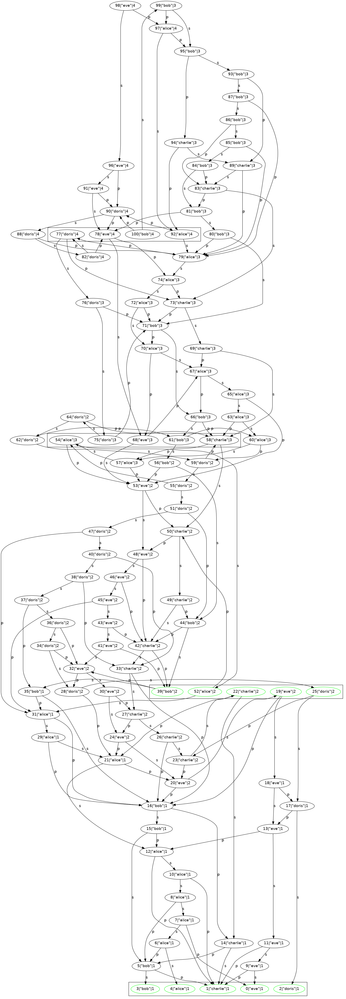

hashgraph
=========

This is a Haskell library implementing the Hashgraph ordering algorithm as described in this
[paper](http://www.swirlds.com/downloads/SWIRLDS-TR-2016-01.pdf). Please note that the original
Hashgraph algorithm is protected by patents in the USA.

To order events, you `insert` them into the `Cache`. Once enough events have been inserted, events
receive a consensus round and time-stamp. Events with received rounds and times are stored in the
field `cReceivedRoundAndTimes` of the `Cache`.

The cache needs to be purged periodically with the `purge` function to not grow indefinitely.

Visualizing
-----------

The `test` executable creates a random Hashgraph with 100 events of 5 creators and prints it with
the `graphviz` package.

Witnesses of each round are grouped together and the famous ones circled in green. Edges are labeled
with `s` or `p` depending on whether they point to the self-parent or other-parent. Event labels
consists of `<event-id | creator | round>`

Disclaimer
----------

I still expect to find some bugs. If you find any please open an issue!
